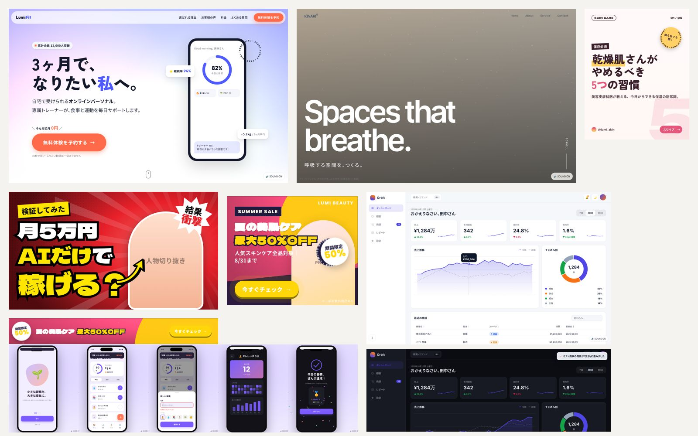

# AI Webデザイン制作スタジオ

**Webデザイン初心者でも、Codex（AI）と一緒にプロ品質の案件制作物を作るためのシステム**です。

- 🎨 **デザインレシピDB 40,000件**：「バナー・サムネイル・SNS画像」「LP」「Webサイト」「UI/UX」の4ジャンルで各10,000件
- ✨ **動き・グラフィック・効果音ライブラリ**：data属性を書くだけで、受賞サイト級のアニメーション／動く背景／合成効果音（30種・著作権フリー）
- 🧩 **高品質テンプレート 7種**：レスポンシブ・アクセシビリティ・モーション・効果音まで実装済み
- 🛠 **自動化ツール**：レシピ検索 → 案件フォルダ自動生成（配色・書体・指示書）→ 品質チェック → PNG/GIF/MP4（効果音入り）書き出し
- 📚 **ナレッジ**：デザイン原則・配色・日本語タイポ・モーション・効果音・コピー・副業の進め方・参考サイト集



---

## クイックスタート

```bash
npm install                # Playwright（書き出し・ブラウザ検査用）。ffmpeg があれば GIF/MP4 も可
npm run serve              # → http://localhost:5173/ でレシピギャラリーを閲覧
```

### 1案件の流れ

```bash
# ① 依頼内容を保存
cp briefs/TEMPLATE.md briefs/sakura-dental.md   # 埋める

# ② 参考レシピを探す
node tools/search.mjs --genre lp 歯科 予約

# ③ 案件フォルダを自動生成（BRIEF.md・tokens.css・テンプレート一式）
node tools/new-project.mjs --genre lp --name sakura-dental --brief briefs/sakura-dental.md 歯科 予約

# ④ Codex に依頼（例）
#   「projects/20261011-sakura-dental/BRIEF.md と AGENTS.md に従って、briefs/sakura-dental.md の内容でLPを完成させて」

# ⑤ チェックと書き出し
node tools/check.mjs projects/20261011-sakura-dental --browser
node tools/render.mjs projects/20261011-sakura-dental/index.html --fullpage
```

### Codex への依頼文の例

- 「`briefs/xxx.md` を読んで、`tools/search.mjs` で合うレシピを3つ提案して。方向性の違うものを選んで」
- 「`node tools/new-project.mjs --ref LP-00381 --name xxx` を実行して、BRIEF.md の通りにLPを仕上げて。写真は images/ のものを使って」
- 「このバナーを 300x250 / 728x90 / 320x100 / 300x600 で書き出して、GIFは150KB以下に」
- 「Instagramリール用に 1080x1920 の効果音付きMP4を作って」
- 「`node tools/check.mjs` のエラーと警告をすべて直して」

---

## ジャンルとテンプレート

| ジャンル | DB | テンプレート |
|---|---|---|
| [バナー・サムネイル・SNS画像](genres/01-banner-sns/AGENTS.md) | `BNR-` 10,000件（22サイズ × 15目的 × 15レイアウト × 20スタイル × 42業種） | `display-banner`（1ファイルで全サイズ自動レイアウト・アニメ）、`sns-post`（Instagram/X/OGP/ストーリーズ）、`youtube-thumbnail` |
| [LP](genres/02-lp/AGENTS.md) | `LP-` 10,000件（8ゴール × 6構成の型 × 10 FV × 8セクション構成） | `lp-standard`（全セクション・BAスライダー・カウントダウン・フォーム演出） |
| [Webサイト](genres/03-website/AGENTS.md) | `WEB-` 10,000件（13サイト種別 × 7ヘッダー × 9ヒーロー × 7グリッド） | `corporate`（4ページ・ローディング・遷移・全画面メニュー・横スクロール） |
| [UI/UX](genres/04-uiux/AGENTS.md) | `UI-` 10,000件（16アプリ種別 × 7プラットフォーム × 16 UXパターン × ペルソナ） | `app-prototype`（触れるスマホアプリ）、`dashboard`（SaaS管理画面） |

## デザインレシピDBについて（大切な説明）

各レシピは **1つの高品質な作品の「設計図」** です：コンセプト／配色5色（コントラスト検証済み）／書体3種（Google Fonts・全72書体の読込確認済み）／
レイアウト・構成／コピー例／グラフィック要素／モーション（実装方法つき）／効果音／オリジナリティを出す一手／品質チェック項目。

- 実在サイトの画像やデザインを収集・複製したものでは**ありません**。受賞サイト・人気バナー・定番UIに共通する
  **デザインパターン**（配色理論・タイポグラフィ・構成の型・UX法則・モーションの定石）を、
  スタイル×業種の **相性ルール** に従って組み合わせて生成した **オリジナルのレシピ** です。
  そのため、レシピ通りに作った成果物は他者の著作物のコピーにならず、案件ごとのオリジナル作品になります。
- 実在のギャラリーサイト（Awwwards・SANKOU!・Mobbin など）は [knowledge/reference-sites.md](knowledge/reference-sites.md) にリンク集として整理しています（研究用）。
- 知識（スタイル・パレット・業種・構成・UX法則など）は `tools/taxonomy/*.mjs` に集約。追加・修正して `npm run build:db` で再生成できます（シード固定で再現性あり）。

## フォルダ構成

```
AGENTS.md        Codex向けの全体指示書（ワークフロー・デザインルール・完了の定義）
genres/          ジャンル別：AGENTS.md / db（レシピ10,000件）/ templates
shared/          共通ライブラリ：base.css, motion.css, motion.js, graphics.js, sfx.js
knowledge/       デザインの知識・副業ワークフロー・参考サイト・dictionary.json
tools/           build-db / search / new-project / check / render / serve / gallery
briefs/          依頼内容（ヒアリングシート）
projects/        案件ごとの制作フォルダ
assets/          共通素材（ロゴ・写真・イラスト）
designs/         デザイン案の画像・ショーケース
delivery/        納品物
```

## コマンド一覧

| コマンド | 内容 |
|---|---|
| `npm run serve` | ギャラリー（40,000件をブラウズ・効果音試聴・制作コマンドをコピー） |
| `node tools/search.mjs [--genre] [--style] [--level] [--format] キーワード…` | レシピ検索（`--id BNR-00001` で詳細、`--json`） |
| `node tools/new-project.mjs --genre … --name … [キーワード] [--ref ID] [--template] [--brief]` | 案件フォルダ生成 |
| `node tools/check.mjs <project> [--browser]` | 品質チェック（コントラスト・alt・SEO・ダミー残り・横スクロール・JSエラー） |
| `node tools/render.mjs <html> [--sizes] [--png] [--gif] [--mp4] [--fullpage]` | 書き出し（MP4は効果音入り） |
| `npm run build:db` | DB再生成（`--count`, `--genre`） |

## 動作環境

Node.js 18+ ／ （書き出し）Playwright・ffmpeg ／ テンプレート自体は依存なしの HTML/CSS/JS（どのサーバーにも置けます）
